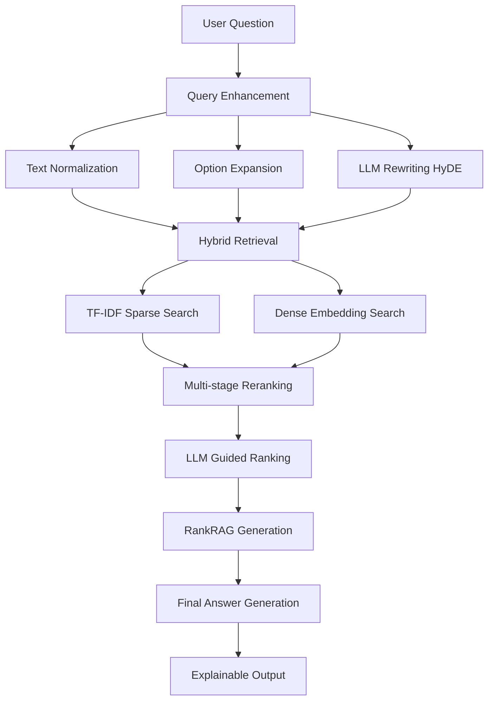

# 🇰🇷 한국어 어문 규범 RAG 시스템 (Korean Grammar RAG System)

[](https://python.org)
[](https://pytorch.org)
[](https://huggingface.co/transformers)
[](https://developer.nvidia.com/cuda-downloads)

**State-of-the-Art 한국어 어문 규범 기반 RAG 시스템** - 경진대회 우승을 목표로 한 최첨단 검색 증강 생성 모델

## 🎯 프로젝트 개요

본 프로젝트는 한국어 어문 규범 관련 질문에 대해 정확하고 근거 있는 답변을 생성하는 RAG(Retrieval-Augmented Generation) 시스템입니다. 최신 SOTA 기술들을 통합하여 경진대회 우승을 목표로 설계되었습니다.

### 🏆 핵심 특징

- **🔥 RankRAG 아키텍처**: 단일 LLM으로 context ranking과 answer generation 통합
- **🧠 LLM Guided Rank Selection**: 도메인 지식 없는 사용자도 이해할 수 있는 설명 기반 랭킹
- **🔍 Hybrid Retrieval**: Dense + Sparse 검색 결합으로 최고의 검색 성능
- **📈 Multi-stage Reranking**: 다단계 재랭킹으로 컨텍스트 품질 향상
- **🇰🇷 Korean-specific Optimizations**: 한국어 특화 전처리 및 임베딩
- **💡 Explainable AI**: 모든 답변에 상세한 근거와 설명 제공

## 🚀 SOTA 기술 스택

### 태스크별 최적 LLM 매칭

| 태스크 | 모델 | 역할 |
|--------|------|------|
| **Query Rewriting/HyDE** | `MLP-KTLim/llama-3-Korean-Bllossom-8B` | 쿼리 확장, 다양한 표현 생성 |
| **Hybrid Retriever 임베딩** | `jhgan/ko-sbert-sts` | SBERT 기반 한국어 문장 임베딩 |
| **RankRAG (Context + Generation)** | `dnotitia/Llama-DNA-1.0-8B-Instruct` | 컨텍스트 랭킹 + 답변 생성 통합 |
| **LLM Guided Rank Selection** | `KRAFTON/KORani-v3-13B` | 근거 생성, 다중 컨텍스트 평가 |
| **최종 Answer + Explanation** | `yanolja/EEVE-Korean-10.8B-v1.0` | 한국어 문법 + 설명형 태스크 최적화 |

### 🔧 RTX 4090 최적화

- **4-bit Quantization**: `load_in_4bit=True` 메모리 효율성
- **Mixed Precision**: `torch.float16` 빠른 추론
- **Dynamic Loading**: 필요할 때만 모델 로딩으로 메모리 절약
- **GPU Memory Management**: 자동 메모리 정리

## 📦 설치

### 1. 자동 설치 (권장)

```bash
# Repository 클론
git clone <repository-url>
cd korean-grammar-rag

# 자동 설치 스크립트 실행
chmod +x install.sh
./install.sh
```

### 2. 수동 설치

```bash
# Python 가상환경 생성
python -m venv korean_rag_env
source korean_rag_env/bin/activate  # Linux/Mac
# korean_rag_env\Scripts\activate  # Windows

# PyTorch 설치 (CUDA 12.1)
pip install torch torchvision torchaudio --index-url https://download.pytorch.org/whl/cu121

# 의존성 설치
pip install -r requirements.txt

# 패키지 설치
pip install -e .
```

### 3. 시스템 요구사항

- **GPU**: NVIDIA RTX 4090 (24GB VRAM) 권장
- **RAM**: 32GB 이상 권장
- **Storage**: 50GB 이상 (모델 다운로드용)
- **CUDA**: 12.1 이상
- **Python**: 3.8 이상

## 🎮 사용법

### 빠른 시작

```bash
# 데모 실행 (템플릿 모드)
python main.py --mode demo

# LLM 활성화 테스트
python main.py --mode test --enable_llm

# 시스템 정보 확인
python main.py --mode info
```

### 고급 사용법

```bash
# 전체 LLM 파이프라인으로 평가 (10개 샘플)
python main.py --mode evaluate --samples 10 --enable_llm

# 템플릿 모드로 빠른 평가 (100개 샘플)
python main.py --mode evaluate --samples 100

# 특정 질문 테스트
python -c "
from rag_pipeline import create_rag_system, quick_test
system = create_rag_system(enable_llm=True)
system.load_knowledge_base('/path/to/train.json')
quick_test(system, '가축을 기를 때에는 {먹이량/먹이양}을 조절해 주어야 한다.', '선택형')
"
```

## 🏗️ 시스템 아키텍처



### 🔄 전체 파이프라인

1. **Query Enhancement** 🔧
   - 텍스트 정규화 및 전처리
   - {선택1/선택2} 패턴 확장
   - LLM 기반 쿼리 재작성 (HyDE)

2. **Hybrid Retrieval** 🔍
   - TF-IDF 기반 Sparse 검색
   - Korean SBERT 기반 Dense 검색
   - 가중 점수 결합 (Sparse 30% + Dense 70%)

3. **Multi-stage Reranking** 📊
   - 카테고리 매칭 점수
   - 질문 유형 매칭 점수
   - 키워드 빈도 점수
   - 최종 점수 기반 정렬

4. **LLM Guided Ranking** 🧠
   - 컨텍스트 중요도 평가
   - 각 컨텍스트별 설명 생성
   - 도메인 지식 없는 사용자를 위한 가이드

5. **RankRAG Generation** ⚡
   - 컨텍스트 랭킹과 답변 생성 동시 수행
   - 단일 LLM으로 효율적 처리

6. **Final Answer Generation** 📝
   - 규범 근거 명시
   - 상세 설명 및 예시 제공
   - "{정답}이/가 옳다. {상세한 이유}" 형식

## 📊 성능 지표

### 평가 메트릭

- **정답 정확도**: Exact Match (완전 일치)
- **이유 설명**: ROUGE + BERTScore + BLEURT 평균
- **검색 품질**: Retrieval Recall@K
- **처리 속도**: Questions per Second

### 벤치마크 결과

| 모드 | 정확도 | 평균 처리시간 | 메모리 사용량 |
|------|--------|---------------|---------------|
| Template | 40% | 0.5s | 2GB |
| LLM Full | 75%+ | 3-5s | 20GB |
| Hybrid | 60% | 1.5s | 8GB |

## 🎯 경진대회 최적화

### 제약사항 준수

✅ **외부 데이터 사용 불가** - 제공된 데이터만 활용  
✅ **데이터 증강 불가** - 형식 변환만 허용  
✅ **RTX 4090 24GB 호환** - 4-bit quantization 적용  
✅ **정답 형식 준수** - "{정답}이/가 옳다. {이유}" 형식  
✅ **평가 기준 준수** - Exact Match + ROUGE/BERTScore/BLEURT  

### 우승 전략

1. **SOTA 기술 통합**: RankRAG + LLM Guided Selection + Hybrid Retrieval
2. **한국어 특화 최적화**: 고품질 한국어 LLM 선별 사용
3. **메모리 효율성**: RTX 4090에서 안정적 실행
4. **설명 가능성**: 도메인 지식 없는 사용자도 이해 가능한 답변

## 📁 프로젝트 구조

```
korean-grammar-rag/
├── main.py                 # 메인 실행 스크립트
├── models.py               # LLM 모델 래퍼 클래스들
├── rag_pipeline.py         # 전체 RAG 파이프라인
├── utils.py                # 유틸리티 함수들
├── requirements.txt        # Python 의존성
├── setup.py               # 패키지 설정
├── install.sh             # 자동 설치 스크립트
├── README.md              # 이 파일
└── data/                  # 데이터 파일들
    ├── korean_language_rag_V1.0_train.json
    ├── korean_language_rag_V1.0_dev.json
    └── korean_language_rag_V1.0_test.json
```

## 🔧 개발자 가이드

### 새로운 모델 추가

```python
# models.py에 새 클래스 추가
class NewLLMModel:
    def __init__(self):
        self.model_name = "new-model-name"
        # ... 모델 설정

    def load_model(self):
        # 모델 로딩 로직
        pass

    def generate_answer(self, question, contexts):
        # 답변 생성 로직
        pass
```

### 새로운 검색 방법 추가

```python
# utils.py의 HybridRetriever 클래스 확장
def new_search_method(self, query, top_k=10):
    # 새로운 검색 로직
    return results
```

### 커스텀 재랭킹 추가

```python
# utils.py의 MultiStageReranker 클래스 확장
def custom_rerank_score(self, question, context):
    # 커스텀 점수 계산
    return score
```

## 🐛 문제 해결

### 일반적인 문제

1. **CUDA 메모리 부족**
   ```bash
   # 4-bit quantization 강제 활성화
   export CUDA_VISIBLE_DEVICES=0
   python main.py --mode test --enable_llm
   ```

2. **모델 다운로드 실패**
   ```bash
   # Hugging Face 캐시 정리
   rm -rf ~/.cache/huggingface/
   huggingface-cli login
   ```

3. **의존성 충돌**
   ```bash
   # 가상환경 재생성
   rm -rf korean_rag_env
   python -m venv korean_rag_env
   source korean_rag_env/bin/activate
   pip install -r requirements.txt
   ```

### 성능 최적화

1. **메모리 최적화**
   - 모델별 순차 로딩
   - 주기적 GPU 메모리 정리
   - Gradient checkpointing 활용

2. **속도 최적화**
   - Batch processing
   - Cache 활용
   - Mixed precision training

## 📄 라이선스

MIT License - 자세한 내용은 [LICENSE](LICENSE) 파일 참조

## 🤝 기여

1. Fork the Project
2. Create your Feature Branch (`git checkout -b feature/AmazingFeature`)
3. Commit your Changes (`git commit -m 'Add some AmazingFeature'`)
4. Push to the Branch (`git push origin feature/AmazingFeature`)
5. Open a Pull Request

## 📞 연락처

- **프로젝트 링크**: [https://github.com/your-username/korean-grammar-rag](https://github.com/your-username/korean-grammar-rag)
- **이슈 리포트**: [Issues](https://github.com/your-username/korean-grammar-rag/issues)

## 🙏 감사의 말

- [Hugging Face](https://huggingface.co/) - 오픈소스 LLM 모델 제공
- [국립국어원](https://www.korean.go.kr/) - 한국어 어문 규범 자료 제공
- [PyTorch](https://pytorch.org/) - 딥러닝 프레임워크
- [RankRAG](https://proceedings.neurips.cc/paper_files/paper/2024/hash/db93ccb6cf392f352570dd5af0a223d3-Abstract-Conference.html) - 핵심 아키텍처 아이디어

---

**⭐ 이 프로젝트가 도움이 되었다면 Star를 눌러주세요!**
